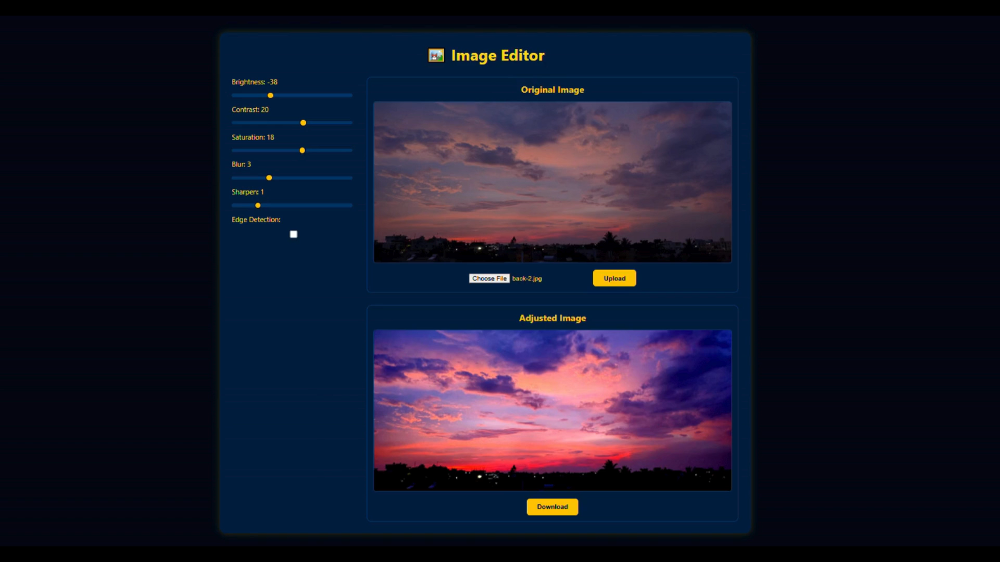

# **FPCV Image Editor**

  

A **web-based image editor** built with **Flask**. Users can upload an image and interactively adjust brightness, contrast, saturation, blur, sharpen, and edge detection. The app displays **original vs edited images** side by side for real-time comparison.

---

## **Demo**



---

## **Features**

* Upload and view original images
* Real-time adjustments with sliders:

  * Brightness
  * Contrast
  * Saturation
  * Blur
  * Sharpen
  * Edge detection toggle
* Original image displayed above edited image
* Download the edited image
* Responsive design for desktop and mobile

---

## **Installation**

<details>
<summary>Click to expand installation instructions</summary>

1. **Clone the repository**

```bash
git clone https://github.com/SaakshiMV/FPCV_ImageExplorer.git
cd fpcv-image-editor
```

2. **Create and activate a virtual environment**

```bash
# Windows
python -m venv venv
venv\Scripts\activate

# Mac/Linux
python -m venv venv
source venv/bin/activate
```

3. **Install dependencies**

```bash
pip install -r requirements.txt
```

4. **Run the app**

```bash
python app.py
```

Open your browser:

```
http://127.0.0.1:5000
```

</details>

---

## **Project Structure**

```
FPCV_ImageExplorer/
│
├── app.py                # Main application logic
├── utils.py              # Image processing helpers
├── requirements.txt      # Python dependencies
├── README.md             # Project documentation
├── .gitignore
├── demo.png              # Demo screenshot
├── demo.gif              # Demo animation
│
├── templates/
│   └── index.html        # HTML interface
│
├── static/               
│ ├── style.css           # CSS for UI
│ └── script.js           # JS for slider updates
└── fpcv/                 # Virtual environment (should be gitignored)

```

---

## **Usage**

1. Upload an image using the file input
2. Adjust sliders to edit image properties
3. Toggle edge detection if needed
4. Download the edited image

---

## **Future Enhancements**

* Live histogram visualization
* Drag-and-drop image upload
* Additional filters (sepia, grayscale, invert, etc.)
* Multiple image format support

---
